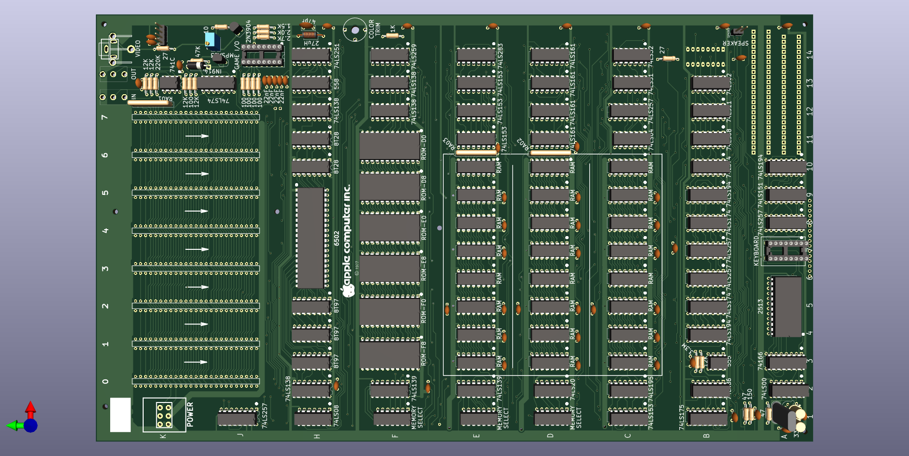

# APPLE II R0 Reproduction #

## Goal
THe primary goal is to have an accurate KiCAD schematic of the 
Apple II Revision 0 System Board. This is supplemented with a
complete reproduction PCB that can be fabricated.

## Apple II R0 Notes

This schematic was taken from the [BitPreserve project](https://github.com/baldengineer/bit-preserve) and compared to the Apple II Gerbers by Mike Willegal (http://www.willegal.net/appleii/appleii-first_page.htm).
When necessary, The Apple II Circuit Description by Winston D. Gayler was consulted.

The PCB layout is a reworking of the Gerbers by Mike Willegal in 
KiCad. Where components are unobtainable from regular suppliers,
substitutes have been used with part number references.

## Current Status

1) Some errors have been found and corrected.
2) Additional work needs to be done to clean-up the schematic.
3) PCB is fully routed but needs mounting holes placing
4) Labelling (silkscreen) on the PCB is messy and needs cleaning up
